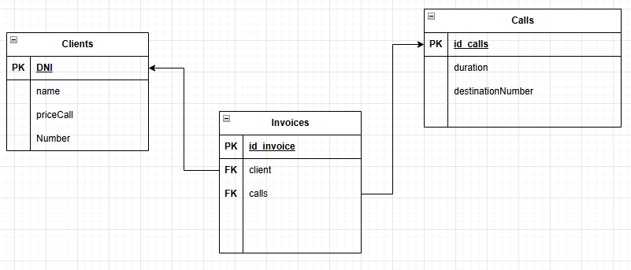
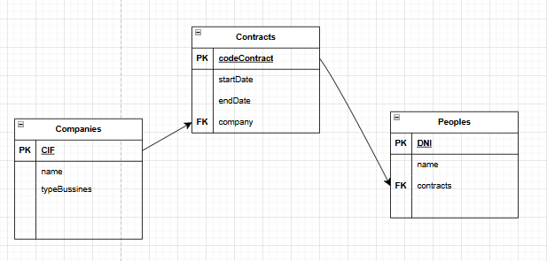

### 1. Casa - Sala - Cuina (_home_)
   Defineix tres classes: Casa, Sala, Cuina. 
   - La classe Sala té com atributs numeroDeTelevisions(int) i tipusSala(String) i
   disposa d'un constructor que l'inicialitza a 0 i "desconegut".
   - La classe Cuina ha de tenir com atributs esIndependent (boolean) i
   nombreDeFogons(int) i un constructor que els inicialitza a false i 0. 
   - La casa tindrà els següents atributs de la classe: superfície(double),
   direcció(String), salaCasa(tipus Sala) i cuinaCasa (tipus Cuina). Defineix un
   constructor per la classe Casa que estableixi uns valors per defecte als
   atributs simples i que creï nous objectes pels atributs Objecte.
- Crea una nova classe per a testejar les classes definides anteriorment. En ella crea
  cases de diferents tipologies i després mostra com es creen els resultats. (Pots fer
  ús del mètode toString() que pots definir a totes les classes).

### 2. Gestió Institut(_institutmanagement_)

Es vol fer un mini gestor per un institut per controlar els alumnes, els mòduls als que
està matriculat un alumne i les seves notes. Guardarem:
   - Per a l'Alumne: nom, cognoms, edat i dni.
   - Per al Mòdul: el nom del mòdul
   - Una matrícula estarà composta per: un alumne, un mòdul i una nota.
   Crea una classe Test amb una simulació de 2 estudiants matriculats a 3 mòduls
   cadascú. Dóna les següents opcions al programa:
   - extreureNotesMitjana: Donat un dni d'entrada, n'extreu la mitjana de les notes
   d'aquest alumne.
   - extreuModulsSuspesos: Donat el Dni d'un alumne, n'extreu els mòduls que
   ha suspès.

### 3. Ferries - Camions (ferriesmanagement)

Volem gestionar certa informació associada als ferries que transporten camions
entre dos ports.
La informació rellevant relativa als camions és: La matrícula del camió i el pes del
camió en Tm.
La informació rellevant relativa als ferries és:
   1. La matrícula del ferry.
   2. El nom del ferry.
   3. El nom del port destí del ferry.
   5. El preu en € que cobra el ferry al camió per cada Tm de pes.
   6. El pes màxim en Tm dels camions transportables pel ferry.
   7. Els camions carregats al ferry.
   A partir de les dades anteriors, creem una classe gestioFerryCamio amb un menu i
   les següents funcionalitats:
   1. Determinar el pes total dels camions embarcats. Ha de retornar la suma dels
   pesos de camions que té el ferry embarcat
   2. Determinar si un camió està embarcat. A partir de la matrícula del camió s'ha
   de descobrir si el camió està embarcat.
   3. Determinar si un camió pot embarcar. Calcular si és possible embarcar un
   camió
   4. Embarcar un camió.
   5. Determinar el camió que ha embarcat en n-èsima posició. Donat un nombre
   enter, determinar quina matrícula i pes té aquest camió.
   6. Determinar l'import del peatge d'un camió.
   7. Determinar el peatge total recaptat.

### 4. Telefonia  (telephony)

   Una empresa de telefonia mòbil vol un programa per a gestionar la facturació de les
   trucades de veu dels seus clients. El preu de les trucades es calcula en funció d'un
   preu per minut que pot variar entre clients. Per cada client guardarem les trucades
   que realitzi.
   Volem dissenyar i escriure un programa que pugui efectuar les operacions següents:
   - Afegir un client, tenint en compte que no pot haver-hi dos clients amb el
   mateix DNI.
   - Afegir una trucada a un client.
   - Escriure per pantalla el detall de la factura actual d'un client (dades del client,
   preu_x_minut, total factura, llistat de trucades (per cada trucada destí i
   duració), total minuts parlats.
   - Fer un llistat de tots clients, detallant el seu DNI, nom i un resum de les dades
   de la factura actual (número de trucades, número de minuts totals, import
   total).
     .  

### 5. Contractes (managementcompany)

Volem gestionar certa informació associada als contractes de persones que
treballen en empreses. 
- **La informació rellevant relativa a les **persones** és:**
  - El seu DNI.
  - El seu nom.
  - El seus contractes
- **La informació rellevant relativa a les **empreses** és:**
  - El seu CIF
  - El seu nom.
  - El sector empresarial.
- **La informació rellevant relativa als **contractes** és:**
  - El codi del contracte.
  - La data d'inici del contracte.
  - La data de l'acabament del contracte.  
  - L'empresa que ha atorgat el contracte.
- A partir de les dades anteriors, volem efectuar les operacions següents:
  1. Determinar la suma total de les durades dels contractes en dies. 
  2. Determinar en quantes empreses diferents ha treballat.
  3. Signar un contracte per una empresa.
  4. Determinar la durada d'un contracte en dies.

    .  

### 6. Consultoris mèdics (medicalappointmentmanagement)

Volem gestionar certa informació associada a la programació de visites en
consultoris mèdics.
- **La informació rellevant relativa a les visites és:**
  1. La data i hora de la visita.
  2. El nom del pacient.
- **La informació rellevant relativa als consultoris és:**
  1. El nom del doctor
  2. L'especialitat mèdica.
  3. Les visites programades del consultori.
- **A partir de les dades anteriors, volem efectuar les operacions següents:**
  1. Verificar si una determinada visita pot ser programada o no.
  2. Programar una visita.
  3. Comptar les visites programades.
  4. Comptar les visites programades entre dues dates.
  5. Desprogramar una visita.
  6. Desprogramar totes les visites.

_Nota: No es podrà programar un visita si n'hi ha una altra a la mateixa data i hora o
si es solapen en un interval de 30 minuts._

### 7. Simulador de gestió de reserves en un hotel

Desenvolupa un sistema per gestionar les reserves d'habitacions en un hotel. Cada
habitació té un tipus (simple, doble, suite) i pot tenir diversos serveis associats (wifi,
minibar, aire condicionat). Utilitza composició per modelar aquestes relacions.
- **Requisits:**
  - Unhotel té una llista d'habitacions.
  - Cadahabitació té un tipus i una llista de serveis.
  - Elsserveis disponibles poden ser wifi, minibar, aire condicionat, etc.
  - Unareserva conté la data d'entrada, data de sortida i l'habitació assignada.
- **Classes:**
  - Hotel: té una llista d'habitacions.
  - Habitacio: té atributs per tipus d'habitació (simple, doble, suite) i llista de
  serveis.
  - Servei: té atributs per al tipus de servei (wifi, minibar, aire condicionat).
  - Reserva: té una data d'entrada, data de sortida i l'habitació reservada.
- **Funcionalitats:**
  - Realitzar reserves per als clients.
  - Obtenir les habitacions disponibles per a dates específiques.
  - Mostrar tots els serveis disponibles per a una habitació.
  - Saber si en una data concreta una habitació concreta està reservada o no.

